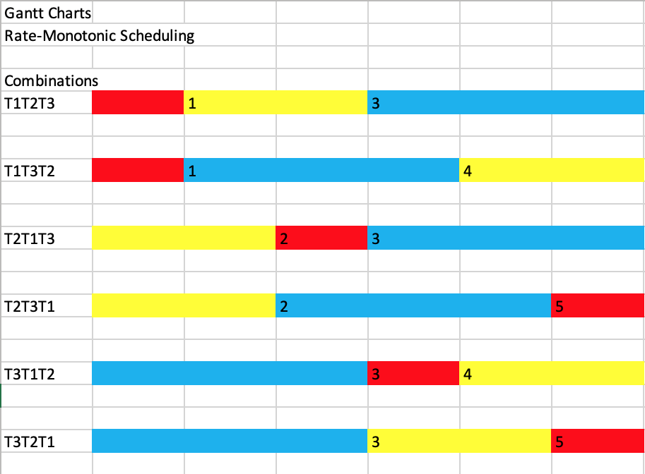
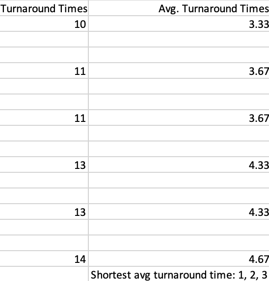

CMSI 387: Operating Systems

Homework 1

Authors: Qiyue Aixinjueluo, Jenna Berlinberg, Alvin Lai

1. Middleware is the software between the application programs and the operating system which provides mechanisms to support interactions between the two. Apps tell middleware the actions to perform, then middleware tells the OS what to do, and finally the OS communicates with the hardware to tell it what to do.

2. A thread is a sequence of programmed actions. Being a unit of concurrency, OS's allow multiple threads to run simultaneously. Processes are containers which hold thread(s) and prevents unnecessarry/unwanted interactions between unrelated threads.

3. TODO: consult with group on an answer

4. a) 1 iteration = 10ms (thread A disk I/O) + 1ms (thread A computation)

    100 * (10ms + 1ms) + 1000ms + 1ms = 2101ms

    b) 1 iteration = 10ms (thread A I/O while B computes) + 1ms switch + 1ms thread A computation + 1ms switch

    100 * (10ms + 1ms + 1ms + 1ms) = 1300ms

    c) B is more efficient because of its resource utilization: keeping the hardware occupied if a thread is idle by allowing other threads to make use of that hardware space. Such resourcefulness may reduces run time significantly.

5. Upon running this program, I found that the messages can be run from the sleeping thread each 5 seconds while the main thread waits on its input. The main thread can read input, kill the second thread, and print out confirmation at the very beginning of the second thread's sleep. The following program also lies in pthreadcancel.c
```c
#include <pthread.h>
#include <unistd.h>
#include <stdio.h>

static void *child(void *ignored){
   while (1) {
     sleep(5);
     printf("Child is done sleeping 5 seconds.\n");
   }
   return NULL;
}

int main(int argc, char *argv[]){
   pthread_t child_thread;
   int code;
   code = pthread_create(&child_thread, NULL, child, NULL);
   if(code){
      fprintf(stderr, "pthread_create failed with code %d\n", code);
   }
   getchar();
   pthread_cancel(child_thread);
   printf("Second thread canceled.\n");
   return 0;
}
```

6.
  
    

7. Following code also provided in the file demographics.c
```c
#include <stdio.h>

int main(int argc, char * argv[]) {
    char name[30];
    int age = -1;
    int classYear = -1;
    char gender[10];
    char state[50];
    char siblings[4];

    printf("What is your name: ");
    fgets(name, sizeof(name), stdin);
    //this is to handle the extra '\n' character at the end of the array
    for (int i = 0; i <= sizeof(name); i++) {
        if(name[i] == '\n') {
            name[i] = '\0';
            break;
        }
    }

    printf("\nWhat is your age: ");
    scanf("%d", &age);
    printf("\nWhat is your class year: ");
    scanf("%d", &classYear);
    printf("\nWhat is your gender: ");
    scanf("%s", gender);
    printf("\nWhich state are you from: ");
    scanf("%s", state);
    printf("\nDo you have siblings (Yes/No): ");
    scanf("%s", siblings);
    printf("\nThank you!\n");

    printf("\n====================\n");
    printf("    Demographics    \n");
    printf("====================\n");
    printf("Name: %s\nAge: %d\nClass year: %d\nGender: %s\nState: %s\nSiblings: %s\n\n", name, age, classYear, gender, state, siblings);
}
```
